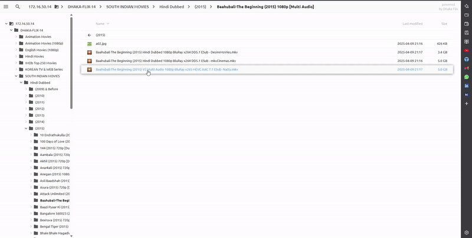

# PotPlayer Streamer

A Chrome extension and native messaging host installer to launch PotPlayer from your browser.



## Features

- Launch PotPlayer directly from Chrome via context menu or popup.
- Native messaging host for seamless integration.
- Easy installation and uninstallation scripts for Windows.

---

## Installation

### 1. Download

- [Latest Release](https://github.com/Ovi246/potplayer-streamer/releases/tag/v1.0.0)

### 2. Install the Native Host

1. Download and extract the `hostInstaller` folder from the release.
2. Run `install.bat` as Administrator to register the native messaging host.
3. To uninstall, run `uninstall.bat` as Administrator.

### 3. Install the Chrome Extension (Manual/Development)

1. Open `chrome://extensions/` in Chrome.
2. Enable "Developer mode" (top right).
3. Click "Load unpacked" and select the `extension` folder.

---

## Usage

- Right-click on a supported link or use the extension popup to launch PotPlayer.
- Ensure PotPlayer is installed and the native host is registered.

---

## Development

- `extension/` — Chrome extension source code.
- `hostInstaller/` — Windows scripts and manifest for native messaging.

### Build & Test

No build step required. Edit files directly and reload the extension in Chrome.

---

## Releasing

1. Update version numbers in `manifest.json` and scripts if needed.
2. Commit and push changes to GitHub.
3. Tag a new release:
   ```bash
   git tag vX.Y.Z
   git push origin vX.Y.Z
   ```
4. Draft a new release on GitHub and upload the latest ZIPs.

---

## Troubleshooting

- If the extension cannot communicate with PotPlayer, ensure the native host is installed and registered.
- Run all installer scripts as Administrator.

---

## License

[MIT](LICENSE)

---

## Credits

- [PotPlayer](https://potplayer.daum.net/)
- Chrome Native Messaging documentation
